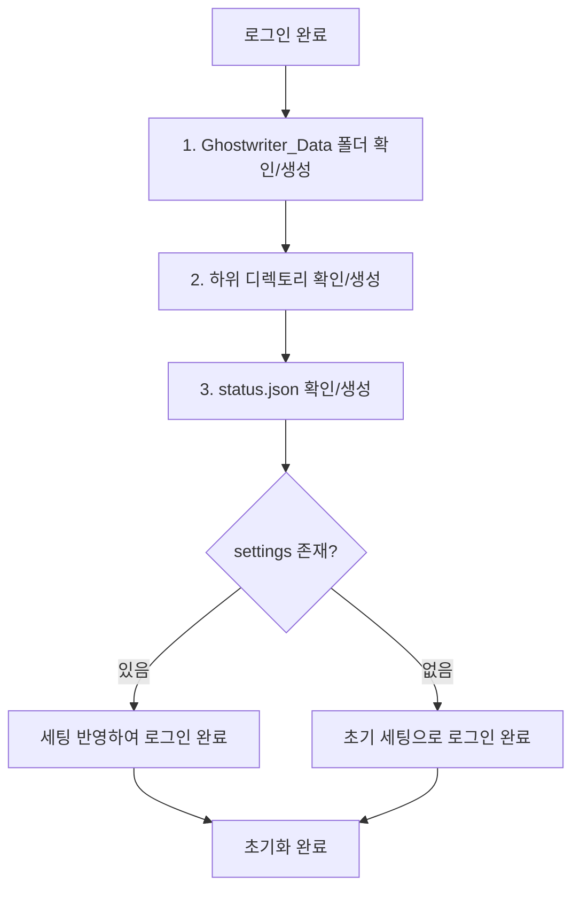

# 초기화 로직 아키텍처

> **목적**: 로그인 후 초기화 구간의 아키텍처 개선안.
> 현재 A를 수정하면 B가 파손되고, B를 고치면 C가 파손되는 연쇄 부작용을 해결하기 위한 설계.

**마지막 업데이트**: 2026-02-19 (압축 이전)

---

## 🎯 초기화 흐름

로그인 후 순차적 처리:



> **핵심 철학**: "있나 → 없으면 만들고 → 있으면 로드하고" — 각 단계가 **독립적이고 멱등적**

---

## 🔍 현재 문제점

| 파일 | 현재 역할 | 문제 |
|------|----------|------|
| `drive.service.js` | 루트 폴더 + status.json 생성 | 하위 폴더 미관리 |
| `storage.manager.js` | 루트 폴더 **재확인** + 하위 폴더 생성 | 중복 검색 |
| `auth.service.js` | 초기화 순서 제어 | 오케스트레이션 + 비즈니스 로직 혼재 |

**근본 원인**: `createWorkspace()`가 `rootFolderId`를 반환하지 않아, `StorageManager`가 다시 검색해야 함. 각 함수가 이전 단계의 결과물을 활용하지 못함.

---

## 💡 개선안: Phase 기반 플러그인 시스템

### 새 구조

```
src/initialization/
├── initialization.orchestrator.js    # 흐름 제어 (Phase 등록 + 순차 실행)
├── workspace.initializer.js          # 폴더 구조 생성
└── settings.initializer.js           # 설정 로드/적용
```

### 핵심: Phase 인터페이스

```javascript
class InitializationPhase {
    constructor(name, description) {
        this.name = name;
        this.description = description;
        this.isCritical = true; // false면 실패해도 계속 진행
    }
    canExecute(context) { return true; }
    async execute(context) { throw new Error('implement me'); }
}
```

### 오케스트레이터

```javascript
export class InitializationOrchestrator {
    constructor() {
        this.phases = [];
        this.context = {};
        
        this.registerPhase(new WorkspaceStructurePhase());  // 폴더 구조
        this.registerPhase(new StatusFilePhase());           // status.json
        this.registerPhase(new SettingsPhase());             // 설정 로드
        // 향후: this.registerPhase(new CharactersLoadPhase());
    }

    async initialize() {
        for (const phase of this.phases) {
            if (!phase.canExecute(this.context)) continue;
            const result = await phase.execute(this.context);
            this.context[phase.name] = result; // 다음 phase에서 참조 가능
        }
    }
}
```

### Before vs After

```
Before: auth → drive(루트) → storage(루트 재검색+하위) → settings
After:  auth → Orchestrator → [Phase1: 폴더] → [Phase2: status] → [Phase3: 설정]
```

| 항목 | Before | After |
|------|--------|-------|
| 초기화 로직 위치 | 3개 파일 분산 | `initialization/` 집중 |
| 루트 폴더 검색 | 2회 | 1회 |
| 에러 원인 파악 | 어려움 | Phase별 명확 |
| 새 단계 추가 | 여러 파일 수정 | Phase 클래스 생성 + 등록 |

---

## 🚀 마이그레이션 전략

1. **Phase 1**: `src/initialization/` 디렉토리 + 새 모듈 생성 (기존 코드 유지)
2. **Phase 2**: `auth.service.js`에서 오케스트레이터 호출로 전환
3. **Phase 3**: `drive.service.js`에서 비즈니스 로직 제거 → 순수 API 래퍼화
4. **Phase 4**: `StorageManager.init()`을 `workspaceInfo`를 받는 형태로 리팩토링

**하위 호환**: 기존 Drive 폴더/파일은 `findOrCreateFolder`의 멱등성으로 그대로 인식됨.

---

## 📚 관련 문서

- [설계 원칙](../principles/design-principles.md) - 4가지 핵심 원칙
- [프로젝트 구조](./project-structure.md) - 파일 배치
- [기술 부채](./tech-debt.md) - 이 문서가 해결하려는 P0 이슈
