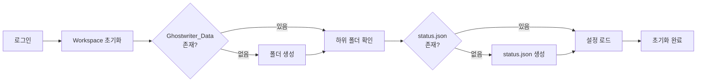
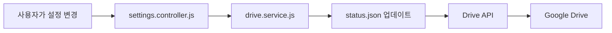
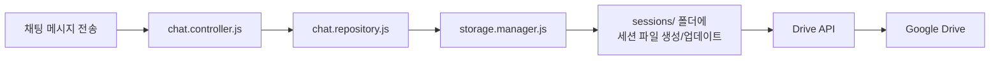

[메인](../index.md) > [Architecture](./README.md) > 데이터 흐름

# 데이터 흐름

> **목적**: Ghostwriter의 데이터가 어떻게 흐르고 저장되는지 설명합니다.

**마지막 업데이트**: 2026-02-15

---

## 📁 Google Drive 구조

```
Google Drive/
└── Ghostwriter_Data/           # 루트 폴더
    ├── status.json             # 시스템 상태 및 설정
    ├── assets/                 # 이미지, 리소스 등
    ├── characters/             # 캐릭터 정의 파일들
    ├── personas/               # 페르소나 파일들
    ├── presets/                # 프리셋 설정들
    └── sessions/               # 채팅 세션 히스토리
```

### 폴더별 설명

| 폴더 | 용도 | 파일 형식 |
|------|------|-----------|
| `Ghostwriter_Data/` | 루트 폴더 | - |
| `status.json` | 시스템 상태 및 사용자 설정 | JSON |
| `assets/` | 이미지, 오디오 등 | 이미지/오디오 파일 |
| `characters/` | 캐릭터 정의 | JSON (각 캐릭터당 1 파일) |
| `personas/` | 페르소나 정의 | JSON |
| `presets/` | 대화 프리셋 | JSON |
| `sessions/` | 채팅 세션 히스토리 | JSON (각 세션당 1 파일) |

---

## 📄 status.json 구조

### 스키마

```json
{
  "system": "online",
  "connected": true,
  "timestamp": "2026-02-15T16:00:00.000Z",
  "settings": {
    "apiKey": "user_api_key",
    "provider": "gemini",
    "model": "gemini-2.0-flash-exp",
    "character": "character_file_id",
    "lastModified": "2026-02-15T16:00:00.000Z"
  }
}
```

### 필드 설명

| 필드 | 타입 | 설명 |
|------|------|------|
| `system` | string | 시스템 상태 (`"online"`) |
| `connected` | boolean | 연결 상태 |
| `timestamp` | ISO 8601 | 마지막 업데이트 시간 |
| `settings` | object | 사용자 설정 |
| `settings.apiKey` | string | LLM API 키 (🔒 향후 암호화 예정) |
| `settings.provider` | string | LLM 제공자 (`"gemini"`, `"openai"` 등) |
| `settings.model` | string | 사용 중인 모델 |
| `settings.character` | string | 현재 선택된 캐릭터의 Drive 파일 ID |
| `settings.lastModified` | ISO 8601 | 설정 마지막 수정 시간 |

---

## 📝 Character 파일 구조 (예시)

```json
{
  "id": "drive_file_id",
  "name": "Ghostwriter",
  "description": "A helpful writing assistant",
  "systemPrompt": "You are a creative writing assistant...",
  "exampleDialogue": [
    { "user": "Help me write a story", "assistant": "..." }
  ],
  "createdAt": "2026-02-01T00:00:00.000Z",
  "updatedAt": "2026-02-15T16:00:00.000Z"
}
```

---

## 💬 Session 파일 구조 (예시)

```json
{
  "id": "drive_file_id",
  "name": "Session 2026-02-15",
  "characterId": "character_drive_file_id",
  "messages": [
    {
      "role": "user",
      "content": "Hello!",
      "timestamp": "2026-02-15T16:00:00.000Z"
    },
    {
      "role": "assistant",
      "content": "Hi! How can I help you?",
      "timestamp": "2026-02-15T16:00:05.000Z"
    }
  ],
  "createdAt": "2026-02-15T16:00:00.000Z",
  "updatedAt": "2026-02-15T16:30:00.000Z"
}
```

---

## 🔄 데이터 흐름 다아어그램

### 초기화 시



### 설정 저장 시



### 채팅 세션 저장 시



---

## 🔐 보안 고려사항

### 현재 상태

- ⚠️ `status.json`의 `apiKey`는 평문으로 저장
- ✅ `drive.file` 스코프만 사용 (앱이 만든 파일만 접근)

### 향후 계획

- 🔜 API 키 암호화 저장
- 🔜 브라우저 로컬 스토리지에 임시 캐시 (선택적)

---

## 📚 관련 문서

- [프로젝트 구조](./project-structure.md) - 코드 디렉토리 구조
- [초기화 프로세스](../features/initialization.md) - 폴더 생성 로직

---

[← Architecture 홈](./README.md) | [← 메인으로](../index.md)

---

**마지막 업데이트**: 2026-02-15
