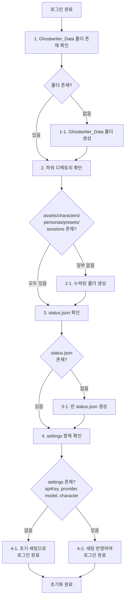
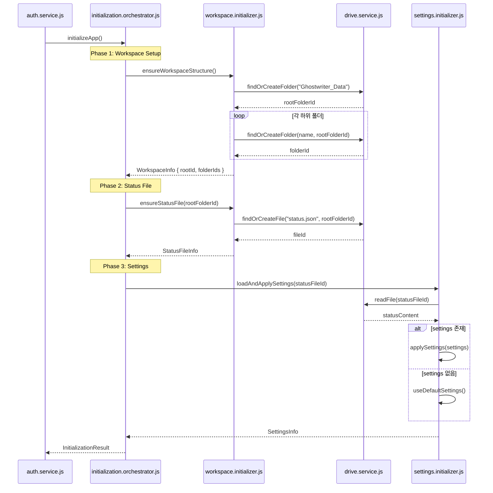

# Ghostwriter 초기화 로직 아키텍처 기획서

## 📋 문서 개요

**작성일**: 2026-02-15  
**목적**: 로그인 후 초기화 구간의 전반적인 재검토 및 아키텍처 개선안 제시  
**작성 배경**: 현재 코드에서 A를 수정하면 B가 파손되고, B를 고치면 C가 파손되는 연쇄 부작용(cascade failure) 문제를 해결하기 위함

---

## 🎯 사용자 요구사항 정리

### 로그인 후 초기화 흐름 (순차적)



### 핵심 철학

> **"있나 → 없음 만들어야 하나 → 만들어야 하면 만들고 → 없어도 되면 내비두고 → 있으면 파일을 불러와서 추후 조작에 쓰일 수 있도록 로드해두고"**

이 흐름이 각각의 단계에서 **독립적이고 멱등적(idempotent)**으로 작동해야 합니다.

---

## 🔍 현재 구조 분석

### 현재 파일 구조

```
src/
├── boot.js                      # 애플리케이션 진입점
├── auth/
│   └── auth.service.js         # 인증 관리 (로그인 후 초기화 트리거)
├── drive/
│   └── drive.service.js        # 드라이브 워크스페이스 생성 (루트 폴더 + status.json)
└── memory/
    └── storage.manager.js      # 하위 폴더 생성 및 관리
```

### 현재 초기화 흐름

**auth.service.js (Line 48-65)**: 로그인 성공 시
```javascript
callback: async (resp) => {
    // 1. createWorkspace() 호출
    await createWorkspace();
    
    // 2. storageManager.init() 호출
    await storageManager.init();
    
    // 3. loadSettingsFromDrive() 호출
    await loadSettingsFromDrive();
}
```

**drive.service.js**: `createWorkspace()`
- Ghostwriter_Data 폴더 확인/생성 ✅
- status.json 확인/생성 ✅
- **하위 폴더는 생성하지 않음** ❌

**storage.manager.js**: `init()`
- Ghostwriter_Data 폴더 다시 확인 (중복) ⚠️
- 하위 폴더 (assets/characters/personas/presets/sessions) 확인/생성 ✅

### 현재 문제점 분석

#### 1. 책임 분산 (Separation of Concerns) 위반

| 파일 | 현재 역할 | 문제점 |
|------|----------|--------|
| `drive.service.js` | 루트 폴더 + status.json 생성 | 하위 폴더는 관리하지 않아 불완전 |
| `storage.manager.js` | 루트 폴더 재확인 + 하위 폴더 생성 | 루트 폴더를 중복으로 확인 |
| `auth.service.js` | 초기화 순서 제어 | 너무 많은 책임 (orchestration + business logic) |

#### 2. 의존성 체인 (Dependency Chain) 문제

```
auth.service.js 
    ↓
drive.service.js (createWorkspace)
    ↓ (rootFolderId를 반환하지 않음)
storage.manager.js (init - 루트 폴더 다시 검색)
    ↓
settings.controller.js (loadSettingsFromDrive)
```

- `createWorkspace()`가 `rootFolderId`를 반환하지 않아, `StorageManager`가 다시 검색해야 함
- 각 함수가 이전 단계의 결과물을 제대로 활용하지 못함
- **A를 고치면 B가 깨지는 근본 원인**

#### 3. 에러 핸들링 부족

현재 코드:
```javascript
try {
    await createWorkspace();
    await storageManager.init();
    await loadSettingsFromDrive();
} catch (err) {
    log('Error initializing app data: ' + err.message, 'error');
    // 어느 단계에서 실패했는지 알 수 없음
}
```

- 어느 단계에서 실패했는지 명확하지 않음
- 부분 실패 시 복구 전략 없음

#### 4. 멱등성 (Idempotency) 미흡

- `createWorkspace()`를 여러 번 호출하면 괜찮지만, 불필요한 API 호출 발생
- `storageManager.init()`는 `isInitialized` 플래그로 멱등성 보장 ✅
- 전체적으로 일관성 없음

---

## 💡 제안: 개선된 아키텍처

### 핵심 원칙

1. **단일 책임 원칙 (Single Responsibility Principle)**
   - 각 모듈은 하나의 명확한 책임만 가짐
   
2. **명확한 의존성 흐름**
   - 각 단계는 이전 단계의 결과를 명시적으로 받음
   - 불필요한 재검색 방지

3. **멱등성 보장**
   - 같은 함수를 여러 번 호출해도 안전

4. **단계별 에러 핸들링**
   - 각 단계의 성공/실패를 명확히 추적

### 제안하는 파일 구조

```
src/
├── boot.js                           # 애플리케이션 진입점 (변경 없음)
├── auth/
│   └── auth.service.js              # 인증 관리 (초기화 트리거만)
├── initialization/                   # 🆕 새로운 디렉토리
│   ├── initialization.orchestrator.js    # 초기화 전체 흐름 제어
│   ├── workspace.initializer.js          # 워크스페이스 구조 생성
│   └── settings.initializer.js           # 설정 로드/초기화
└── drive/
    └── drive.service.js             # 순수한 드라이브 API 래퍼
```

### 새로운 초기화 흐름



---

## 📦 새로운 모듈 상세 설계

### 1. initialization.orchestrator.js

**책임**: 초기화 전체 흐름 제어, 에러 핸들링, 진행 상태 추적

```javascript
/**
 * 초기화 오케스트레이터
 * 로그인 후 전체 초기화 흐름을 제어합니다.
 */

export class InitializationOrchestrator {
    constructor() {
        this.status = {
            workspace: 'pending',      // pending | success | failed
            statusFile: 'pending',
            settings: 'pending'
        };
    }

    /**
     * 전체 초기화 프로세스 실행
     * @returns {Promise<InitializationResult>}
     */
    async initialize() {
        const result = {
            success: false,
            workspace: null,
            settings: null,
            errors: []
        };

        try {
            // Phase 1: Workspace Structure
            log('Phase 1/3: Setting up workspace structure...', 'info');
            result.workspace = await this._initializeWorkspace();
            this.status.workspace = 'success';

            // Phase 2: Status File
            log('Phase 2/3: Ensuring status file...', 'info');
            const statusFileId = await this._initializeStatusFile(result.workspace.rootFolderId);
            this.status.statusFile = 'success';

            // Phase 3: Load Settings
            log('Phase 3/3: Loading settings...', 'info');
            result.settings = await this._initializeSettings(statusFileId);
            this.status.settings = 'success';

            result.success = true;
            log('✅ Initialization complete!', 'success');
            return result;

        } catch (error) {
            // 단계별 에러 정보 포함
            const failedPhase = Object.entries(this.status)
                .find(([_, status]) => status === 'pending')?.[0] || 'unknown';
            
            log(`❌ Initialization failed at phase: ${failedPhase}`, 'error');
            result.errors.push({ phase: failedPhase, error: error.message });
            throw error;
        }
    }

    async _initializeWorkspace() { /* ... */ }
    async _initializeStatusFile(rootFolderId) { /* ... */ }
    async _initializeSettings(statusFileId) { /* ... */ }
}
```

**특징**:
- 각 단계의 성공/실패를 명확히 추적
- 실패 시 어느 단계에서 실패했는지 즉시 파악 가능
- 전체 초기화 결과를 구조화된 객체로 반환

---

### 2. workspace.initializer.js

**책임**: Ghostwriter_Data 폴더와 하위 디렉토리의 물리적 구조 생성

```javascript
/**
 * 워크스페이스 초기화
 * Google Drive에 필요한 폴더 구조를 생성합니다.
 */

const REQUIRED_FOLDERS = {
    root: 'Ghostwriter_Data',
    subfolders: ['assets', 'characters', 'personas', 'presets', 'sessions']
};

export class WorkspaceInitializer {
    /**
     * 워크스페이스 구조 보장
     * @returns {Promise<WorkspaceInfo>} { rootFolderId, folderIds: {...} }
     */
    async ensureWorkspaceStructure() {
        log('Checking workspace structure...', 'info');

        // 1. 루트 폴더 확인/생성
        const rootFolderId = await driveService.findOrCreateFolder(
            REQUIRED_FOLDERS.root
        );
        log(`✓ Root folder: ${REQUIRED_FOLDERS.root}`, 'success');

        // 2. 하위 폴더 확인/생성
        const folderIds = {};
        for (const folderName of REQUIRED_FOLDERS.subfolders) {
            folderIds[folderName] = await driveService.findOrCreateFolder(
                folderName,
                rootFolderId  // 부모 폴더 명시
            );
            log(`✓ Subfolder: ${folderName}`, 'info');
        }

        return {
            rootFolderId,
            folderIds,
            timestamp: new Date().toISOString()
        };
    }

    /**
     * status.json 파일 보장
     * @param {string} rootFolderId
     * @returns {Promise<string>} fileId
     */
    async ensureStatusFile(rootFolderId) {
        log('Checking status.json...', 'info');

        const fileId = await driveService.findOrCreateFile(
            'status.json',
            rootFolderId,
            {
                system: "online",
                connected: true,
                timestamp: new Date().toISOString(),
                settings: null  // 초기에는 null
            }
        );

        log(`✓ status.json ready`, 'success');
        return fileId;
    }
}
```

**특징**:
- 폴더 구조만 담당 (단일 책임)
- 필요한 폴더 목록을 상수로 관리
- 각 단계의 성공을 명확히 로깅

---

### 3. settings.initializer.js

**책임**: status.json에서 설정 로드 및 애플리케이션에 적용

```javascript
/**
 * 설정 초기화
 * status.json에서 사용자 설정을 로드하고 적용합니다.
 */

const DEFAULT_SETTINGS = {
    apiKey: null,
    provider: 'gemini',
    model: 'gemini-2.0-flash-exp',
    character: null
};

export class SettingsInitializer {
    /**
     * 설정 로드 및 적용
     * @param {string} statusFileId
     * @returns {Promise<SettingsInfo>}
     */
    async loadAndApplySettings(statusFileId) {
        log('Loading settings from status.json...', 'info');

        try {
            // 1. status.json 읽기
            const statusContent = await driveService.readFile(statusFileId);

            // 2. settings 필드 확인
            const settings = statusContent.settings;

            if (settings && this._isValidSettings(settings)) {
                // 3-1. 유효한 설정이 있으면 적용
                await this._applySettings(settings);
                log('✓ Settings loaded from Drive', 'success');
                
                return {
                    source: 'drive',
                    settings: settings,
                    isComplete: this._isSettingsComplete(settings)
                };
            } else {
                // 3-2. 설정이 없거나 잘못되었으면 기본값 사용
                await this._applySettings(DEFAULT_SETTINGS);
                log('✓ Using default settings', 'info');
                
                return {
                    source: 'default',
                    settings: DEFAULT_SETTINGS,
                    isComplete: false
                };
            }
        } catch (error) {
            log('Failed to load settings, using defaults', 'warning');
            await this._applySettings(DEFAULT_SETTINGS);
            
            return {
                source: 'default',
                settings: DEFAULT_SETTINGS,
                isComplete: false,
                error: error.message
            };
        }
    }

    _isValidSettings(settings) {
        // settings 객체 구조 검증
        return typeof settings === 'object' && settings !== null;
    }

    _isSettingsComplete(settings) {
        // apiKey와 character가 모두 설정되어 있는지
        return !!(settings.apiKey && settings.character);
    }

    async _applySettings(settings) {
        // UI에 설정 반영
        // 예: settingsController.applySettings(settings)
    }
}
```

**특징**:
- 설정 로드와 적용만 담당
- 유효성 검증 포함
- 실패 시 안전한 기본값 제공

---

### 4. drive.service.js (리팩토링)

**책임**: Google Drive API의 순수한 래퍼 (비즈니스 로직 제거)

```javascript
/**
 * Drive Service
 * Google Drive API에 대한 순수한 래퍼입니다.
 * 비즈니스 로직은 포함하지 않습니다.
 */

export class DriveService {
    /**
     * 폴더 찾기 또는 생성 (멱등)
     * @param {string} name - 폴더명
     * @param {string|null} parentId - 부모 폴더 ID (null이면 루트)
     * @returns {Promise<string>} folderId
     */
    async findOrCreateFolder(name, parentId = null) {
        // 1. 검색
        let q = `mimeType = 'application/vnd.google-apps.folder' and name = '${name}' and trashed = false`;
        if (parentId) {
            q += ` and '${parentId}' in parents`;
        }

        const response = await gapi.client.drive.files.list({ q, fields: 'files(id)' });

        // 2. 있으면 반환
        if (response.result.files.length > 0) {
            return response.result.files[0].id;
        }

        // 3. 없으면 생성
        const metadata = {
            name: name,
            mimeType: 'application/vnd.google-apps.folder'
        };
        if (parentId) {
            metadata.parents = [parentId];
        }

        const createResponse = await gapi.client.drive.files.create({
            resource: metadata,
            fields: 'id'
        });

        return createResponse.result.id;
    }

    /**
     * 파일 찾기 또는 생성 (멱등)
     * @param {string} name - 파일명
     * @param {string} parentId - 부모 폴더 ID
     * @param {Object} defaultContent - 파일이 없을 때 생성할 기본 내용
     * @returns {Promise<string>} fileId
     */
    async findOrCreateFile(name, parentId, defaultContent) {
        // 1. 검색
        const q = `name = '${name}' and '${parentId}' in parents and trashed = false`;
        const response = await gapi.client.drive.files.list({
            q,
            fields: 'files(id)'
        });

        // 2. 있으면 반환 (내용 확인/수정 안 함)
        if (response.result.files.length > 0) {
            return response.result.files[0].id;
        }

        // 3. 없으면 생성
        return await this.createFile(name, parentId, defaultContent);
    }

    /**
     * 파일 생성
     */
    async createFile(name, parentId, content) { /* 기존 로직 */ }

    /**
     * 파일 읽기
     */
    async readFile(fileId) { /* 기존 로직 */ }

    /**
     * 파일 업데이트
     */
    async updateFile(fileId, content) { /* 기존 로직 */ }
}

export const driveService = new DriveService();
```

**특징**:
- 비즈니스 로직 완전 제거
- 순수한 CRUD 작업만 수행
- 멱등성 보장

---

## 🔄 통합: auth.service.js 수정

```javascript
// auth.service.js

import { InitializationOrchestrator } from '../initialization/initialization.orchestrator.js';

const orchestrator = new InitializationOrchestrator();

// ... (기존 코드)

gisScript.onload = () => {
    tokenClient = google.accounts.oauth2.initTokenClient({
        client_id: getClientId(),
        scope: SCOPES,
        callback: async (resp) => {
            if (resp.error !== undefined) {
                throw (resp);
            }
            
            log('Token received. User authenticated.', 'success');
            updateUIState(true);

            // 🆕 단순화된 초기화 호출
            try {
                const result = await orchestrator.initialize();
                
                if (result.success) {
                    log('Application ready!', 'success');
                } else {
                    log('Initialization completed with warnings', 'warning');
                }
            } catch (err) {
                log('Critical initialization failure: ' + err.message, 'error');
                console.error('Initialization error details:', err);
                // 사용자에게 재시도 옵션 제공 가능
            }
        },
    });
    // ... (기존 코드)
};
```

**개선점**:
- 초기화 로직을 오케스트레이터에 위임
- 에러 핸들링이 명확해짐
- 향후 초기화 로직 변경 시 auth.service.js는 건드리지 않아도 됨

---

## 🎨 아키텍처 비교

### Before (현재)

```
auth.service.js (너무 많은 책임)
    ├─ createWorkspace() [drive.service.js]
    │   ├─ 루트 폴더 생성
    │   └─ status.json 생성
    ├─ storageManager.init() [storage.manager.js]
    │   ├─ 루트 폴더 재확인 (중복!)
    │   └─ 하위 폴더 생성
    └─ loadSettingsFromDrive() [settings.controller.js]
        └─ status.json 읽기
```

**문제점**:
- 책임 분산 불명확
- 중복 작업 (루트 폴더 2번 확인)
- 의존성 체인 복잡
- A를 고치면 B, C가 파손

### After (제안)

```
auth.service.js (트리거만)
    └─ InitializationOrchestrator.initialize()
        ├─ WorkspaceInitializer.ensureWorkspaceStructure()
        │   └─ DriveService (순수 API 래퍼)
        ├─ WorkspaceInitializer.ensureStatusFile()
        │   └─ DriveService
        └─ SettingsInitializer.loadAndApplySettings()
            └─ DriveService
```

**개선점**:
- 각 모듈의 책임이 명확
- 중복 작업 제거
- 의존성 흐름이 단방향
- 한 모듈 수정 시 다른 모듈에 영향 최소화

---

## 📊 기대 효과

### 1. 유지보수성 (Maintainability) 향상

| 항목 | Before | After |
|------|--------|-------|
| 초기화 로직 수정 위치 | 3개 파일에 분산 | 1개 디렉토리 집중 |
| 폴더 생성 로직 중복 | 2곳 | 0곳 |
| 에러 발생 시 원인 파악 | 어려움 | 단계별로 명확 |
| 새 단계 추가 시 | 여러 파일 수정 | orchestrator만 수정 |

### 2. 테스트 가능성 (Testability) 향상

- 각 모듈을 독립적으로 테스트 가능
- DriveService를 모킹(mocking)하여 단위 테스트 작성 용이

### 3. 확장성 (Extensibility) 향상

향후 추가될 수 있는 기능:
- ✅ 초기화 재시도 로직
- ✅ 초기화 진행률 UI 표시
- ✅ 오프라인 모드 지원
- ✅ 다른 클라우드 스토리지 지원 (Dropbox, OneDrive)

### 4. 안정성 (Reliability) 향상

- 부분 실패 시 복구 전략 구현 가능
- 멱등성 보장으로 재시도 안전

---

## 🚀 마이그레이션 전략

### Phase 1: 새 모듈 생성 (기존 코드 유지)

1. `src/initialization/` 디렉토리 생성
2. 새로운 모듈들 작성
3. 기존 코드와 병렬로 유지

### Phase 2: 점진적 전환

1. `auth.service.js`에서 새 오케스트레이터 사용하도록 수정
2. 기존 `createWorkspace()`, `storageManager.init()` 호출 제거
3. 테스트 및 검증

### Phase 3: 레거시 클린업

1. `drive.service.js`에서 비즈니스 로직 제거
2. 사용되지 않는 코드 정리
3. `storage.manager.js` 리팩토링 (필요 시)

### Phase 4: 문서화 및 최적화

1. 각 모듈에 JSDoc 추가
2. 에러 메시지 개선
3. 로깅 체계 통일

---

## 💬 엔지니어 관점에서의 논의 사항

### 1. 질문: StorageManager는 어떻게 되나요?

**답변**: 현재 `StorageManager`는 두 가지 역할을 합니다:
- 폴더 구조 초기화 (중복)
- 아이템 CRUD 작업 (personas, characters 등)

**제안**:
- 폴더 구조 초기화는 `WorkspaceInitializer`로 이동
- `StorageManager`는 순수하게 아이템 관리만 담당
- `init()` 메서드는 폴더 ID를 받아서 저장하도록 변경

```javascript
// 수정 후
class StorageManager {
    async init(workspaceInfo) {
        // 폴더 ID를 받아서 저장만 함 (생성 로직 제거)
        this.rootFolderId = workspaceInfo.rootFolderId;
        this.folders = workspaceInfo.folderIds;
        this.isInitialized = true;
    }
    
    // saveItem, loadItem, listItems 등은 그대로 유지
}
```

### 2. 질문: 성능은 괜찮나요? API 호출이 더 많아지지 않나요?

**답변**: 
- 현재도 루트 폴더를 2번 검색하고 있어 이미 비효율적
- 새 구조는 **중복 제거**로 오히려 API 호출 감소
- 각 폴더당 1번의 `findOrCreateFolder` 호출로 통일
- 결과를 명시적으로 전달하여 재검색 불필요

**API 호출 횟수 비교**:

| 작업 | Before | After | 변화 |
|------|--------|-------|------|
| 루트 폴더 확인 | 2회 | 1회 | -1 |
| 하위 폴더 5개 확인 | 5회 | 5회 | 0 |
| status.json 확인 | 1회 | 1회 | 0 |
| **총계** | **8회** | **7회** | **-1** |

### 3. 질문: 기존 사용자들은 어떻게 되나요?

**답변**:
- 새 구조는 **완전히 하위 호환**
- 기존에 생성된 폴더/파일은 그대로 인식
- `findOrCreateFolder`는 멱등적이므로 안전
- 기존 `status.json`의 settings도 그대로 로드됨

### 4. 질문: 오케스트레이터가 필요한가요? 너무 복잡하지 않나요?

**답변**:
- 현재도 `auth.service.js`가 사실상 오케스트레이터 역할
- 차이점은 **명시적으로 분리**했다는 것
- 복잡도가 증가하는 게 아니라 **책임이 명확해짐**
- 향후 초기화 로직 수정 시 한 곳만 보면 됨

### 5. 질문: 에러 발생 시 어떻게 되나요?

**답변**:
현재는 전체가 실패하지만, 새 구조에서는:

```javascript
// Phase 1 실패 → workspace 폴더 자체를 만들지 못함 → 치명적
// Phase 2 실패 → status.json 없음 → 경고만 표시, 계속 진행 가능
// Phase 3 실패 → 설정 못 불러옴 → 기본값 사용, 계속 진행

// 각 단계에서 복구 전략 구현 가능
```

### 6. 질문: 단위 테스트는 어떻게 작성하나요?

**답변**:

```javascript
// DriveService를 모킹
const mockDriveService = {
    findOrCreateFolder: jest.fn().mockResolvedValue('mock-folder-id'),
    findOrCreateFile: jest.fn().mockResolvedValue('mock-file-id'),
    readFile: jest.fn().mockResolvedValue({ settings: { ... } })
};

// WorkspaceInitializer 테스트
const initializer = new WorkspaceInitializer(mockDriveService);
const result = await initializer.ensureWorkspaceStructure();

expect(mockDriveService.findOrCreateFolder).toHaveBeenCalledWith('Ghostwriter_Data');
expect(result.rootFolderId).toBe('mock-folder-id');
```

---

## 📝 다음 단계 제안

1. **사용자 피드백 수렴**
   - 이 기획서에 대한 의견
   - 누락된 요구사항 확인
   - 우선순위 조정

2. **상세 구현 계획 작성**
   - 각 모듈의 상세 스펙
   - 마이그레이션 체크리스트
   - 테스트 계획

3. **프로토타입 작성** (선택)
   - 핵심 흐름만 먼저 구현
   - 기존 코드와 비교 테스트

4. **본격 구현**
   - Phase 1부터 순차적으로 진행

---

## 🔧 추가 논의사항 (2026-02-15 업데이트)

### 1. 오케스트레이터의 확장성 문제 해결

#### 문제 인식
향후 하위 폴더(characters, presets 등)의 **내용물 검사 및 로드** 기능이 추가될 예정입니다. 이를 오케스트레이터에 계속 추가하다 보면 다시 "수정의 2차 피해" 문제를 겪을 수 있습니다.

#### 해결 방안: 플러그인 기반 Phase 시스템

오케스트레이터가 비대해지지 않도록 **Phase 기반 확장 시스템**을 도입합니다:

```javascript
/**
 * 초기화 Phase 인터페이스
 * 각 Phase는 이 인터페이스를 구현해야 합니다.
 */
class InitializationPhase {
    constructor(name, description) {
        this.name = name;
        this.description = description;
    }

    /**
     * Phase 실행
     * @param {Object} context - 이전 phase들의 결과를 담은 컨텍스트
     * @returns {Promise<Object>} 이 phase의 결과
     */
    async execute(context) {
        throw new Error('execute() must be implemented');
    }

    /**
     * Phase 실행 전 검증
     * @param {Object} context
     * @returns {boolean} 실행 가능 여부
     */
    canExecute(context) {
        return true;
    }
}
```

**오케스트레이터 리팩토링**:

```javascript
export class InitializationOrchestrator {
    constructor() {
        this.phases = [];
        this.context = {};
        
        // 기본 Phase 등록
        this.registerPhase(new WorkspaceStructurePhase());
        this.registerPhase(new StatusFilePhase());
        this.registerPhase(new SettingsPhase());
        
        // 🆕 향후 추가될 Phase들은 여기 등록만 하면 됨
        // this.registerPhase(new CharactersLoadPhase());
        // this.registerPhase(new PresetsLoadPhase());
    }

    registerPhase(phase) {
        if (!(phase instanceof InitializationPhase)) {
            throw new Error('Phase must extend InitializationPhase');
        }
        this.phases.push(phase);
    }

    async initialize() {
        const result = {
            success: false,
            phases: {},
            errors: []
        };

        for (let i = 0; i < this.phases.length; i++) {
            const phase = this.phases[i];
            
            try {
                log(`Phase ${i + 1}/${this.phases.length}: ${phase.description}`, 'info');
                
                if (!phase.canExecute(this.context)) {
                    log(`⊘ Skipping ${phase.name} (preconditions not met)`, 'info');
                    continue;
                }

                const phaseResult = await phase.execute(this.context);
                
                // 결과를 컨텍스트에 저장 (다음 phase에서 사용 가능)
                this.context[phase.name] = phaseResult;
                result.phases[phase.name] = { success: true, result: phaseResult };
                
                log(`✅ ${phase.name} complete`, 'success');
                
            } catch (error) {
                log(`❌ ${phase.name} failed: ${error.message}`, 'error');
                result.errors.push({ 
                    phase: phase.name, 
                    error: error.message 
                });
                
                // Phase가 critical하면 중단, 아니면 계속
                if (phase.isCritical) {
                    throw error;
                }
            }
        }

        result.success = result.errors.length === 0;
        return result;
    }
}
```

**Phase 구현 예시**:

```javascript
// 🆕 향후 추가될 Phase
class CharactersLoadPhase extends InitializationPhase {
    constructor() {
        super('charactersLoad', 'Loading character files...');
        this.isCritical = false; // 실패해도 계속 진행
    }

    canExecute(context) {
        // workspace phase가 성공했을 때만 실행
        return context.workspaceStructure?.folderIds?.characters;
    }

    async execute(context) {
        const charactersFolderId = context.workspaceStructure.folderIds.characters;
        
        // 1. characters 폴더 내 파일 목록 조회
        const files = await driveService.listFiles(charactersFolderId);
        
        // 2. 각 파일 로드
        const characters = [];
        for (const file of files) {
            try {
                const character = await driveService.readFile(file.id);
                characters.push(character);
            } catch (err) {
                log(`Warning: Failed to load character ${file.name}`, 'warning');
            }
        }
        
        log(`Loaded ${characters.length} characters`, 'info');
        
        return {
            characters,
            count: characters.length
        };
    }
}

// 기존 Phase들도 리팩토링
class WorkspaceStructurePhase extends InitializationPhase {
    constructor() {
        super('workspaceStructure', 'Setting up workspace structure...');
        this.isCritical = true; // 이게 실패하면 전체 중단
    }

    async execute(context) {
        const initializer = new WorkspaceInitializer();
        return await initializer.ensureWorkspaceStructure();
    }
}
```

#### 장점

1. **오케스트레이터는 절대 수정하지 않음**
   - 새 기능은 새 Phase 클래스만 만들고 등록
   - 기존 Phase 수정해도 다른 Phase에 영향 없음

2. **의존성 관리가 명확**
   - `canExecute()`로 실행 조건 명시
   - `context`로 이전 phase 결과 참조

3. **선택적 실행**
   - Phase별로 `isCritical` 플래그로 실패 시 동작 제어
   - 특정 Phase만 건너뛸 수 있음

4. **테스트 용이**
   - 각 Phase를 독립적으로 테스트
   - Mock context로 쉽게 테스트 환경 구성

---

### 2. 로깅 시스템 투명성 보장

#### 현재 상태 ✅

**좋은 소식**: 현재 `log()` 함수는 **이미 인웹 화면에 표시**됩니다!

- `logger.js`의 `log()` 함수가 `#console-output` div에 메시지 추가
- 사용자는 실시간으로 시스템 동작을 확인할 수 있음
- 시간, 메시지, 타입(info/success/error)이 모두 표시됨

```javascript
// src/utils/logger.js (현재)
export function log(msg, type = 'info') {
    const time = new Date().toLocaleTimeString();
    const div = document.createElement('div');
    div.className = `log-line ${type}`;
    div.innerText = `[${time}] ${msg}`;

    if (consoleOutput) {
        consoleOutput.appendChild(div);  // ✅ 인웹 표시
        consoleOutput.scrollTop = consoleOutput.scrollHeight;
    }
    
    subscribers.forEach(cb => cb({ time, msg, type }));
}
```

#### 개선 제안: 로깅 강화

사용자 신뢰도 향상을 위해 다음과 같이 개선하겠습니다:

##### 1. 로그 레벨 세분화

```javascript
export const LogLevel = {
    DEBUG: 'debug',     // 🔍 개발자용 상세 정보
    INFO: 'info',       // ℹ️ 일반 정보
    SUCCESS: 'success', // ✅ 성공
    WARNING: 'warning', // ⚠️ 경고 (계속 진행 가능)
    ERROR: 'error'      // ❌ 에러
};

export function log(msg, type = 'info', details = null) {
    const time = new Date().toLocaleTimeString();
    const div = document.createElement('div');
    div.className = `log-line ${type}`;
    
    // 아이콘 추가
    const icons = {
        debug: '🔍',
        info: 'ℹ️',
        success: '✅',
        warning: '⚠️',
        error: '❌'
    };
    
    div.innerText = `[${time}] ${icons[type] || ''} ${msg}`;
    
    // 상세 정보가 있으면 접을 수 있도록 (optional)
    if (details) {
        div.title = JSON.stringify(details, null, 2);
        div.style.cursor = 'help';
    }

    if (consoleOutput) {
        consoleOutput.appendChild(div);
        consoleOutput.scrollTop = consoleOutput.scrollHeight;
    }

    // DevTools 콘솔에도 출력 (개발자용)
    console[type === 'error' ? 'error' : 'log'](`[${type.toUpperCase()}]`, msg, details);
    
    subscribers.forEach(cb => cb({ time, msg, type, details }));
}
```

##### 2. 드라이브 작업 명시적 로깅

```javascript
// drive.service.js에서
export class DriveService {
    async findOrCreateFolder(name, parentId = null) {
        log(`🔎 Searching for folder: "${name}"...`, 'debug');
        
        // ... (검색 로직)
        
        if (response.result.files.length > 0) {
            log(`📁 Found existing folder: "${name}"`, 'success', { 
                folderId: response.result.files[0].id 
            });
            return response.result.files[0].id;
        }

        log(`📁 Creating new folder: "${name}"...`, 'info');
        
        // ... (생성 로직)
        
        log(`📁 Folder created: "${name}"`, 'success', { 
            folderId: createResponse.result.id 
        });
        
        return createResponse.result.id;
    }

    async readFile(fileId) {
        log(`📄 Reading file: ${fileId}`, 'debug');
        
        try {
            const content = await /* ... */;
            log(`📄 File read successfully`, 'success');
            return content;
        } catch (error) {
            log(`📄 Failed to read file: ${error.message}`, 'error', { 
                fileId, 
                error: error.message 
            });
            throw error;
        }
    }
}
```

##### 3. 초기화 진행 상황 표시

```javascript
// initialization.orchestrator.js
async initialize() {
    const totalPhases = this.phases.length;
    
    log(`🚀 Starting initialization (${totalPhases} phases)...`, 'info');
    
    for (let i = 0; i < this.phases.length; i++) {
        const phase = this.phases[i];
        const progress = `[${i + 1}/${totalPhases}]`;
        
        log(`${progress} ${phase.description}`, 'info');
        
        try {
            const phaseResult = await phase.execute(this.context);
            log(`${progress} ✅ ${phase.name} complete`, 'success');
        } catch (error) {
            log(`${progress} ❌ ${phase.name} failed`, 'error', { 
                error: error.message,
                phase: phase.name
            });
        }
    }
    
    log(`🎉 Initialization complete!`, 'success');
}
```

##### 4. 사용자 신뢰도 향상을 위한 로그 예시

초기화 시 사용자가 보게 될 로그:

```
[16:13:45] 🚀 Starting initialization (3 phases)...
[16:13:45] [1/3] Setting up workspace structure...
[16:13:46] 📁 Found existing folder: "Ghostwriter_Data"
[16:13:46] 📁 Found existing folder: "characters"
[16:13:46] 📁 Found existing folder: "personas"
[16:13:47] 📁 Creating new folder: "presets"...
[16:13:47] 📁 Folder created: "presets"
[16:13:47] [1/3] ✅ workspaceStructure complete
[16:13:47] [2/3] Ensuring status file...
[16:13:48] 📄 Found existing file: "status.json"
[16:13:48] [2/3] ✅ statusFile complete
[16:13:48] [3/3] Loading settings...
[16:13:49] 📄 Reading file: ABC123XYZ...
[16:13:49] ✅ Settings loaded from Drive
[16:13:49] [3/3] ✅ settings complete
[16:13:49] 🎉 Initialization complete!
```

사용자는 정확히 무슨 일이 일어나는지 알 수 있습니다:
- ✅ 어떤 폴더가 이미 있고, 어떤 폴더를 새로 만드는지
- ✅ 드라이브에서 무엇을 읽고 쓰는지
- ✅ 각 단계가 성공했는지 실패했는지
- ✅ 전체 진행 상황 (몇 번째 단계인지)

#### 보안 고려사항

민감한 정보는 로그에 표시하지 않습니다:

```javascript
// ❌ 나쁜 예
log('API Key saved: sk-abc123xyz...', 'success');

// ✅ 좋은 예
log('API Key saved successfully', 'success', { 
    provider: 'gemini',
    keyLength: apiKey.length,
    // 실제 키 값은 숨김
});
```

---

## 📚 부록: 용어 정리

- **멱등성 (Idempotency)**: 같은 작업을 여러 번 수행해도 결과가 동일한 특성
- **오케스트레이터 (Orchestrator)**: 여러 컴포넌트의 작업을 조율하는 조정자
- **단일 책임 원칙 (SRP)**: 하나의 모듈은 하나의 책임만 가져야 한다는 설계 원칙
- **의존성 주입 (Dependency Injection)**: 객체가 필요한 의존성을 외부에서 받는 패턴
- **Phase**: 초기화 과정의 독립적인 단계. 각각의 Phase는 특정 작업을 수행하며 다른 Phase와 독립적

---

**📌 이 문서는 살아있는 기획서입니다. 구현 과정에서 발견되는 이슈나 더 나은 아이디어가 있다면 계속 업데이트됩니다.**

---

## 📋 업데이트 히스토리

| 날짜 | 내용 |
|------|------|
| 2026-02-15 | 초안 작성 |
| 2026-02-15 (오후) | 오케스트레이터 확장성 및 로깅 투명성 섹션 추가 |
